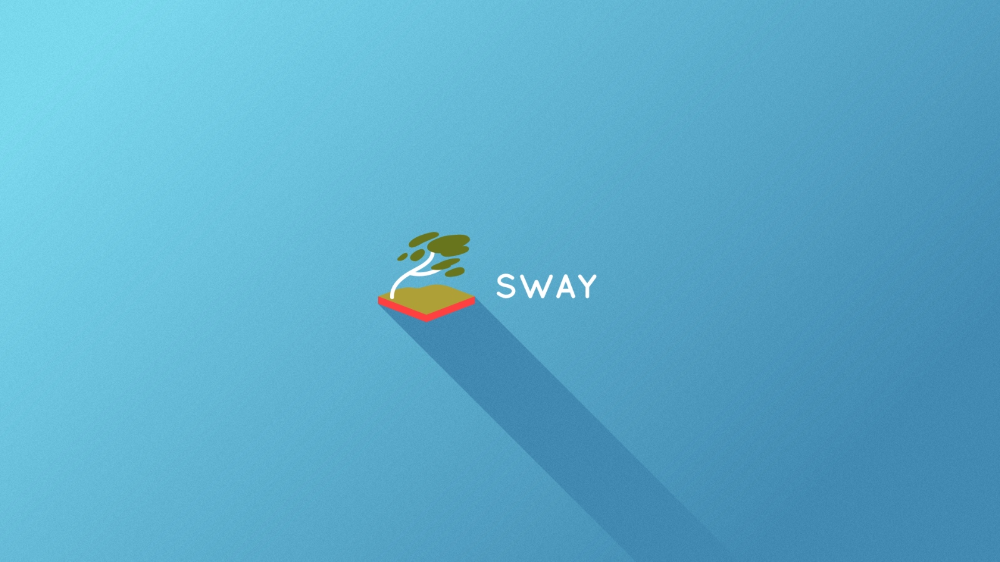

# Arch Linux / Sway / My Setup
---
## Clone Configuration Files  
Clone the files in this repository to:  
```bash
/home/username/.config
```

---

## Create GTK Configuration File  
Create a file named `.gtkrc-2.0` in the folder:  
```bash
/home/username/
```

### Add the following content to the file:  
```text
gtk-theme-name="Breeze-Dark"
gtk-icon-theme-name="breeze-dark"
```

---

## Install Themes and Utilities  
Open a terminal and run:  
```bash
sudo pacman -S breeze breeze-gtk breeze-icons mako wofi
```

---

## Install Fonts  
```bash
sudo pacman -S noto-fonts noto-fonts-emoji ttf-font-awesome

```

### Clear Font Cache  
```bash
fc-cache -rv
```

### Reboot the System  
```bash
reboot
```

### Test Notifications  
Send a test alert:  
```bash
notify-send "🔔 Alert" "This is test 🎉"
```

---

## Install USB Utility  
```bash
sudo pacman -S udisks2 udiskie
```

---

## Install Git  
```bash
sudo pacman -S git
```

---

## Install AUR Helper  
1. Clone the `yay` repository:  
   ```bash
   git clone https://aur.archlinux.org/yay.git
   ```
2. Navigate to the folder:  
   ```bash
   cd yay
   ```
3. Build and install the package:  
   ```bash
   makepkg -si
   ```

---

## Install Additional Packages  

### Utilities  
- `bpytop`
- `htop`
- `neofetch`
- `udisksd`
- `duf`

### File Managers  
- `pcmanfm`
- `ranger`

### Text Editor  
- `mousepad`

### Image Editor  
- `mtpaint`

### Screenshot Tools  
- `grim`
- `slurp`

### Code Editor  
- `visual-studio-code-bin`

### Browsers  
- `firefox`
- `lynx`
- `qutebrowser`

### Remote Desktop Tools  
- `remmina`
- `freerdp`

### FTP Client  
- `filezilla`

### Archiver Tools  
- `xarchiver`
- `p7zip`

### Media Players  
- `vlc`
- `mpv`

### Live Wallpaper Utility  
- `mpvpaper`

### Security Tools  
- `keepassxc`

### Office Suite  
- `libreoffice-still`

---

## Install All Packages Quickly  

### Using Pacman  
```bash
sudo pacman -S bpytop htop neofetch udisksd duf pcmanfm ranger mousepad firefox lynx qutebrowser remmina freerdp filezilla xarchiver p7zip vlc mpv keepassxc libreoffice-still grim slurp mtpaint
```

### Using AUR  
```bash
yay -S visual-studio-code-bin google-chrome mpvpaper
```

---

# Arch Linux / Sway / Hotkeys Setup  

### Application Shortcuts  
- **`Mod+I`**: Open Google Chrome  
- **`Mod+C`**: Open Visual Studio Code  
- **`Mod+Z`**: Open FileZilla  
- **`Mod+X`**: Open Xarchiver  
- **`Mod+M`**: Open File Manager (`pcmanfm`)  
- **`Mod+N`**: Open Notepad (`mousepad`)  
- **`Mod+P`**: Open Paint (`mtpaint`)  

### Screenshots  
- **`Fn+PrintScreen`**: Capture a screenshot  

---


---

### **Basic Window Operations**
- **`Mod+Enter`** — Open a terminal.  
- **`Mod+Shift+Q`** — Close the active window.  
- **`Mod+Arrow keys`** — Navigate between windows.  
- **`Mod+Shift+Arrow keys`** — Move the active window in the specified direction.  
- **`Mod+F`** — Toggle fullscreen mode.  
- **`Mod+S`** — Switch the active window to stacking layout.  
- **`Mod+W`** — Switch the active window to tabbed layout.  
- **`Mod+E`** — Switch the active window to tiled layout.  

---

### **Workspaces**
- **`Mod+1..9`** — Switch to workspace 1-9.  
- **`Mod+Shift+1..9`** — Move the active window to workspace 1-9.  

---

### **Screen Splitting**
- **`Mod+V`** — Split windows vertically.  
- **`Mod+H`** — Split windows horizontally.  

---

### **Resizing**
- **`Mod+Right Mouse Button`** — Resize a window manually.  
- **`Mod+R`** — Toggle resize mode, then use **Arrow keys** to resize the active window.  

---

### **Restart and Exit**
- **`Mod+Shift+C`** — Reload configuration (`sway config`).  
- **`Mod+Shift+E`** — Exit Sway.  
- **`Mod+Shift+R`** — Restart Sway.  

---

### **Other Useful Keybindings**
- **`Mod+P`** — Open output menu (change connected monitors).  
- **`Mod+D`** — Open application launcher (usually **wofi**).  
- **`Mod+L`** — Lock the screen (requires `swaylock`).  
- **`Mod+Shift+S`** — Take a screenshot (requires `grim` and `slurp`).  
